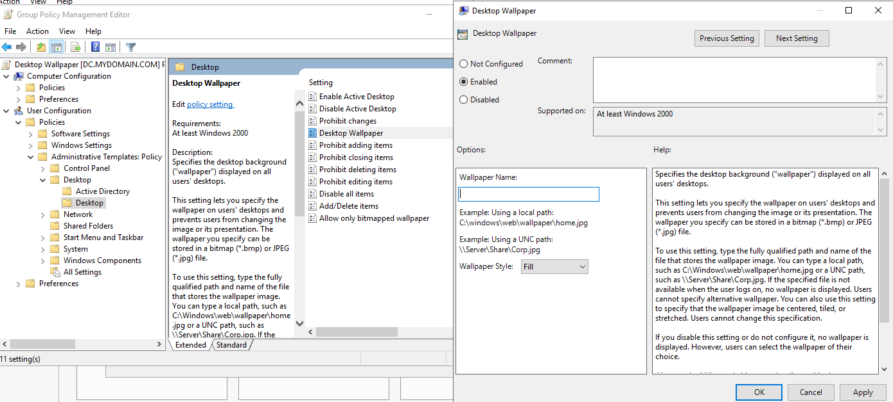

# Active Directory Homelab - Desktop Wallpaper Policy

## Overview
Set a default desktop wallpaper for all users.

## Tools Used
- Group Policy Management

## Steps
1. Open Group Policy Management
2. Open Forest dropdown -> mydomain.com
3. Right click "mydomain.com" -> click "Create a GPO in this domain, and link it here..."
4. Name it "Desktop Wallpaper"
5. Right Click "Desktop Wallpaper" and edit.
6. Computer or User Configuration? **USER CONFIGURATION!** Why? Because we want to apply this GPO whenever the user login.
7. Policies or Preferences? **POLICIES!** Why? Because we don't want the user changing the desktop wallpaper.
8. Policies -> Administrative Templates: Policy -> Desktop -> Desktop

