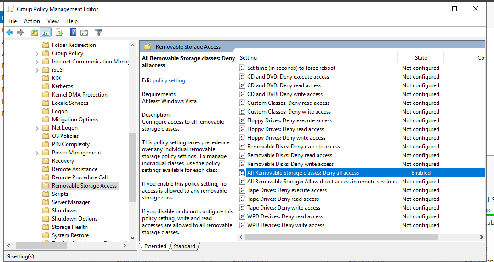

# Active Directory Homelab - Disable USB Storage

## Overview
Prevent users from using USB storage devices.

## Tools Used
- Group Policy Management

## Steps
1. Open Group Policy Management
2. Open Forest dropdown -> mydomain.com
3. Right click "mydomain.com" -> click "Create a GPO in this domain, and link it here..."
4. Name it "Disable USB devices"
5. Right Click "Disable USB devices" and edit.
6. Computer or User Configuration? **COMPUTER CONFIGURATION!** Why? Because we are applying it directly on the computer. *or could it be user? i mean both makes sense to me.*
7. Policies or Preferences? **POLICIES!** Why? Because we want to enforce restrictions on what the users cannot do - in this case use USB devices.
8. Policies -> Administrative Templates: Policy -> System -> Removable Storage Access.

