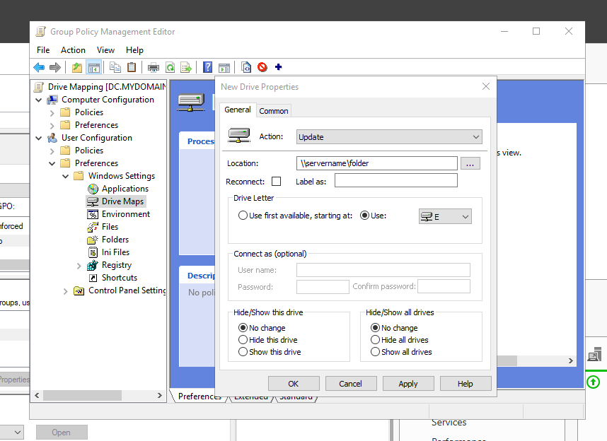

# Active Directory Homelab - Drive Mapping

## Overview
Map network drives for users when they login.

## Tools Used
- Group Policy Management

## Steps
1. Open Group Policy Management
2. Open Forest dropdown -> mydomain.com
3. Right click "mydomain.com" -> click "Create a GPO in this domain, and link it here..."
4. Name it "Drive Mapping"
5. Right Click "Drive Mapping" and edit.
6. Computer Configuration OR User Configuration...? **USER CONFIGURATION!** The user is the one who will be using this policy.
7. Policy OR Preferences...? **PREFERENCES!** Why? Because the user can later alter/modify/add the drive maps later on.
8. User Configuration -> Preferences -> Window Settings -> Right Click "Drive Maps" -> New -> Mapped Drive
9. Apply -> OK

