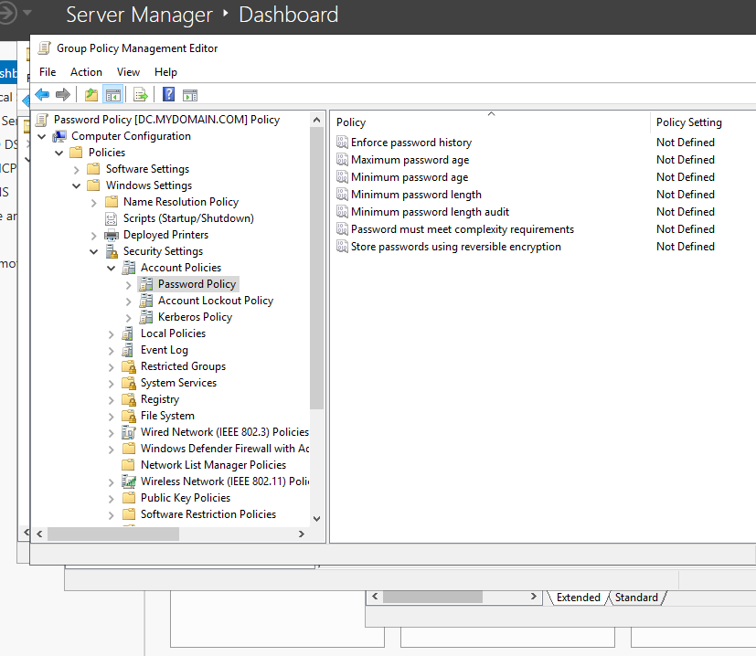

# Active Directory Homelab - Group Policy Management

## Overview
Practicing Group Policy Management by setting a password policy on every computer in the domain.

## Tools Used
- Group Policy Management

## Steps
1. Open Group Policy Management
2. Open Forest dropdown -> mydomain.com
3. Right click "mydomain.com" -> click "Create a GPO in this domain, and link it here..."
4. Name it "Password Policy"
5. Right Click "Password Policy" and edit.
6. We will choose "Computer Configuration" so EVERY computer requires the password policy.
7. Computer Configuration -> Policies -> Window Settings -> Security Settings -> Account Policies -> Password Policies

**For this lab - "Password Complexity" will NOT be enabled. 