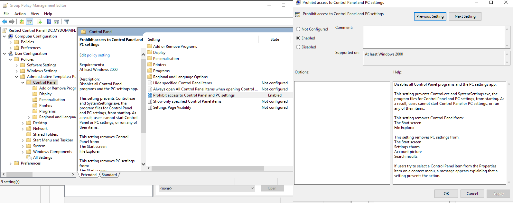

# Active Directory Homelab - Restrict Access To Control Panel

## Overview
Prevent users from accessing the Control Panel.

## Tools Used
- Group Policy Management

## Steps
1. Open Group Policy Management
2. Open Forest dropdown -> mydomain.com
3. Right click "mydomain.com" -> click "Create a GPO in this domain, and link it here..."
4. Name it "Restrict Control Panel"
5. Right Click "Restrict Control Panel" and edit.
6. Computer or User Configuration? **USER CONFIGURATION!** Why? Because the user will be using the computer and it will be applied to them.
7. Policies or Preferences? **POLICIES!** Why? Because we want to enforce restrictions on what the users cannot access.
8. Policies -> Administrative Templates: Policy -> Control Panel -> Prohibit access to Control Panel and PC settings.

